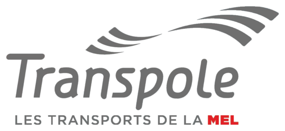

= L-Ticket

== Screens

=== Splash Screen

[NOTE.speaker]
--
The Splash screen is the *first* app screen. It has a duration of 3 secondes and it is composed with Transpole logo.
--

=== Home Screen

[NOTE.speaker]
--
This screen comes after the 3 splash screen secondes. On this screen there are a Google MAP and a form, where you insert a location which will be shown with a map marker.
--
